# Arquitetura Visual — Plataforma ScanSOLO

> Versão: 0.1 — Maio 2026  
> Status: Decisões travadas, pré-implementação  
> Todos os diagramas em Mermaid (compatível GitHub / Obsidian / Notion)

---

## Índice

1. [Diagrama Geral da Plataforma](#1-diagrama-geral-da-plataforma)
2. [Fluxo Nova Entrada](#2-fluxo-nova-entrada)
3. [Fluxo A — Upload pelo Sistema](#3-fluxo-a--upload-pelo-sistema)
4. [Fluxo B — Arquivos já no Dropbox](#4-fluxo-b--arquivos-já-no-dropbox)
5. [Dropbox vs Supabase Storage](#5-dropbox-vs-supabase-storage)
6. [Worker Python — Processamento GPR](#6-worker-python--processamento-gpr)
7. [IA Automática — Pipeline Completo](#7-ia-automática--pipeline-completo)
8. [Revisão Opcional pelo Analista](#8-revisão-opcional-pelo-analista)
9. [Cartografia — Objetivo Final](#9-cartografia--objetivo-final)
10. [Geração de Relatório](#10-geração-de-relatório)
11. [Permissões por Perfil](#11-permissões-por-perfil)
12. [Estados do Projeto](#12-estados-do-projeto)
13. [Versionamento por Run](#13-versionamento-por-run)

---

## 1. Diagrama Geral da Plataforma

Visão macro de todos os componentes e suas integrações.

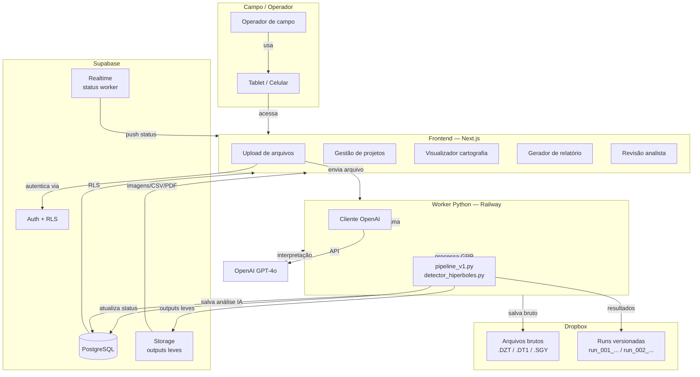

> **Nota de portabilidade:** Next.js, Supabase, Railway e OpenAI GPT-4o estão aprovados para implementação inicial. A arquitetura preserva portabilidade futura: worker Python pode ser migrado para VPS/Docker sem alterar o pipeline; modelo de IA pode ser substituído se custo, escala ou performance exigirem.

---

## 2. Fluxo Nova Entrada

Decisão de roteamento quando um arquivo ou projeto novo chega ao sistema.

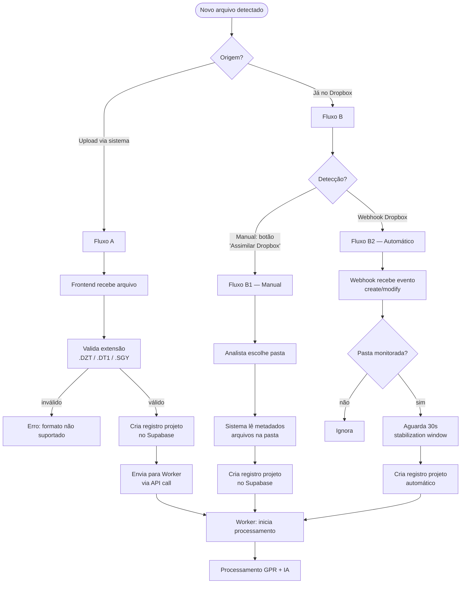

---

## 3. Fluxo A — Upload pelo Sistema

Detalhe do caminho quando o arquivo sobe diretamente pelo frontend.

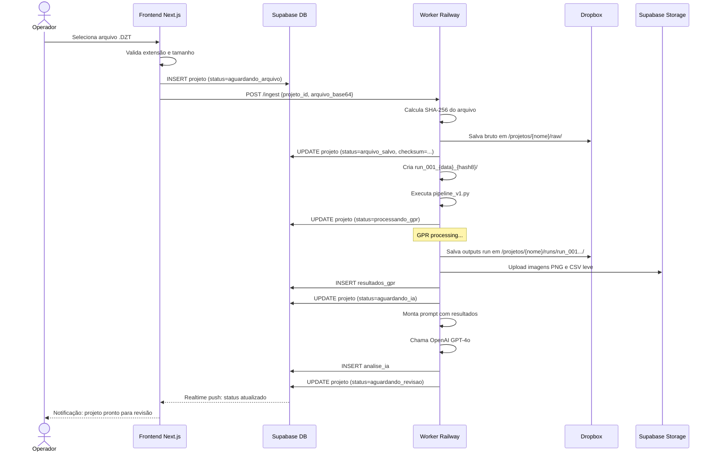

---

## 4. Fluxo B — Arquivos já no Dropbox

Os dois sub-fluxos (manual e webhook) para arquivos que chegam diretamente ao Dropbox.

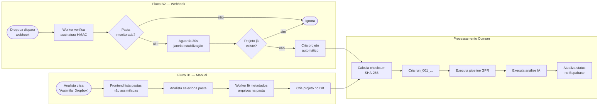

---

## 5. Dropbox vs Supabase Storage

Regra clara de onde cada tipo de arquivo vive.

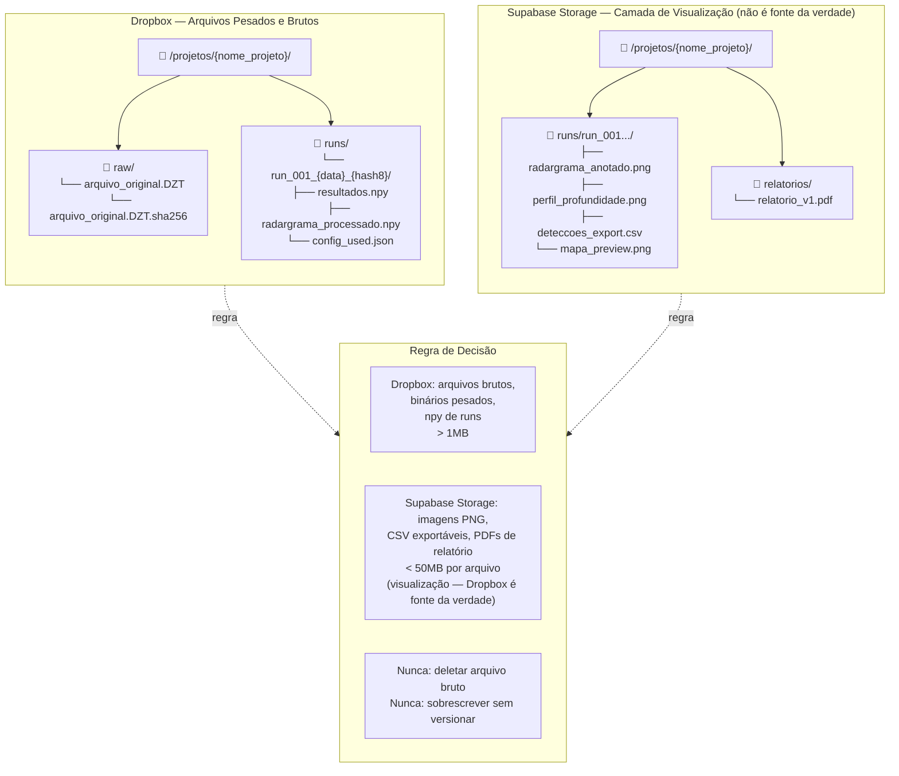

---

## 6. Worker Python — Processamento GPR

Fluxo interno do worker durante o processamento de um arquivo GPR.

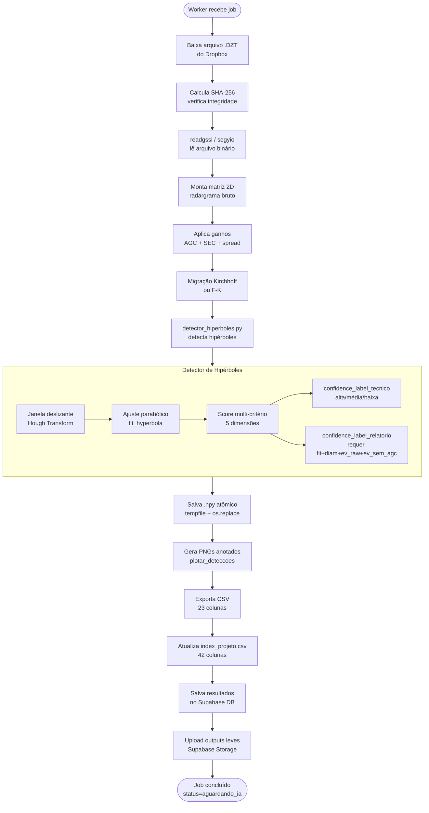

---

## 7. IA Automática — Pipeline Completo

A análise de IA é sempre automática após o GPR. Não é opcional.

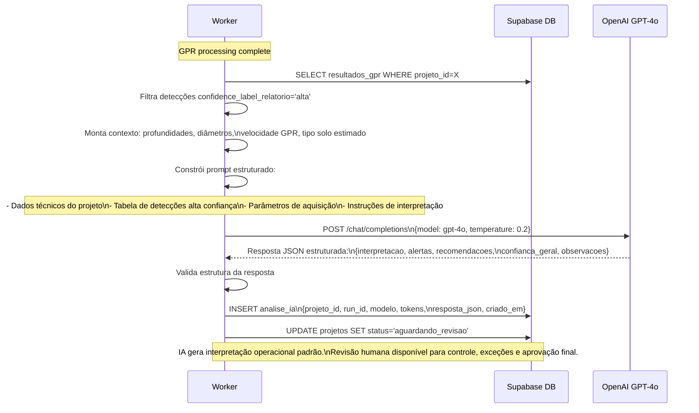

---

## 8. Revisão Opcional pelo Analista

O analista pode revisar, ajustar ou validar os resultados da IA. É opcional — o projeto pode ir para relatório sem revisão manual.

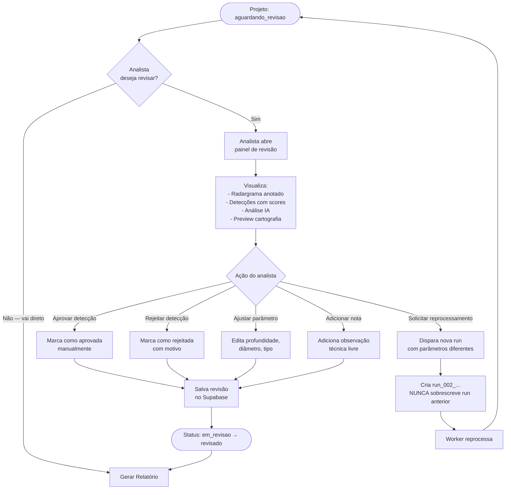

---

## 9. Cartografia — Objetivo Final

**Meta: substituir completamente o trabalho manual de montagem de planta/croqui.** A integração com o fluxo atual do Amilson é etapa de compatibilidade e validação — não é o destino final. Após validação, o sistema produz o entregável cartográfico de forma autônoma.

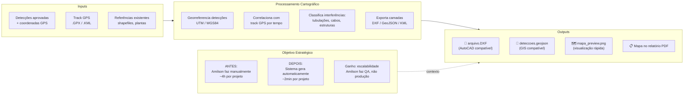

---

## 10. Geração de Relatório

Fluxo de composição e entrega do relatório final ao cliente.

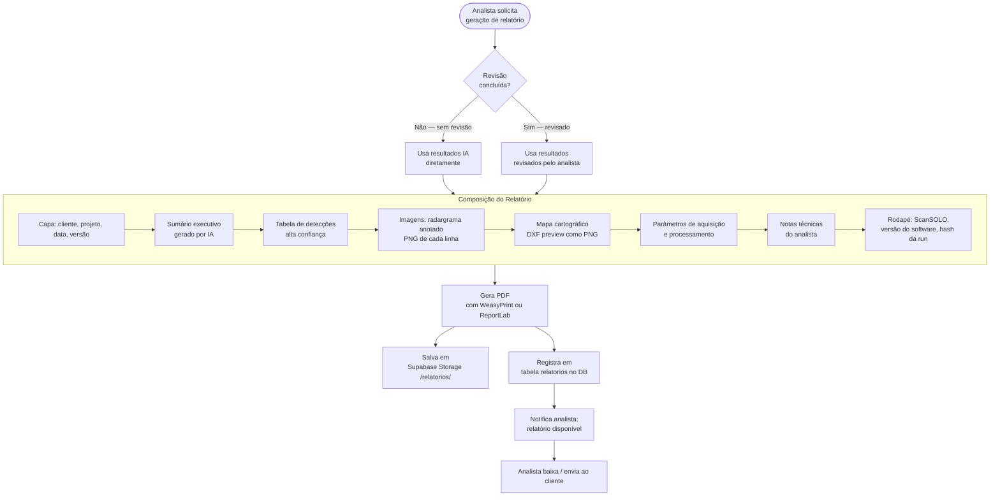

---

## 11. Permissões por Perfil

Matrix de acesso: o que cada perfil pode e não pode fazer.

> **Regra de segurança absoluta:** nenhuma rota, componente ou resposta do frontend pode expor `DROPBOX_TOKEN`, `OPENAI_API_KEY` ou `SUPABASE_SERVICE_ROLE_KEY`. Essas credenciais existem exclusivamente em variáveis de ambiente server-side (worker Railway e Next.js Server Components). Code review deve verificar isso antes de qualquer merge.

```mermaid
graph TB
    subgraph PERFIS["Perfis de Usuário"]
        ADMIN[👑 Admin ScanSOLO]
        ANALISTA[🔬 Analista Técnico]
        OPERADOR[👷 Operador de Campo]
    end

    subgraph ACOES["Ações do Sistema"]
        A01[Ver todos os projetos]
        A02[Ver projeto específico]
        A03[Upload de arquivos]
        A04[Fluxo B: assimilar Dropbox]
        A05[Ver resultados técnicos GPR]
        A06[Ver análise IA]
        A07[Revisar / editar detecções]
        A08[Gerar relatório]
        A09[Ver relatório gerado]
        A10[Acessar configurações]
        A11[Gerenciar usuários]
        A12[Ver dados de outros projetos]
    end

    ADMIN -->|✅| A01
    ADMIN -->|✅| A02
    ADMIN -->|✅| A03
    ADMIN -->|✅| A04
    ADMIN -->|✅| A05
    ADMIN -->|✅| A06
    ADMIN -->|✅| A07
    ADMIN -->|✅| A08
    ADMIN -->|✅| A09
    ADMIN -->|✅| A10
    ADMIN -->|✅| A11
    ADMIN -->|✅| A12

    ANALISTA -->|✅ próprios| A01
    ANALISTA -->|✅| A02
    ANALISTA -->|✅| A03
    ANALISTA -->|✅| A04
    ANALISTA -->|✅| A05
    ANALISTA -->|✅| A06
    ANALISTA -->|✅| A07
    ANALISTA -->|✅| A08
    ANALISTA -->|✅| A09
    ANALISTA -->|❌| A10
    ANALISTA -->|❌| A11
    ANALISTA -->|❌| A12

    OPERADOR -->|❌| A01
    OPERADOR -->|✅ só status| A02
    OPERADOR -->|✅| A03
    OPERADOR -->|❌| A04
    OPERADOR -->|❌| A05
    OPERADOR -->|❌| A06
    OPERADOR -->|❌| A07
    OPERADOR -->|❌| A08
    OPERADOR -->|❌| A09
    OPERADOR -->|❌| A10
    OPERADOR -->|❌| A11
    OPERADOR -->|❌| A12
```

---

## 12. Estados do Projeto

Máquina de estados completa de um projeto desde a criação até o arquivamento.

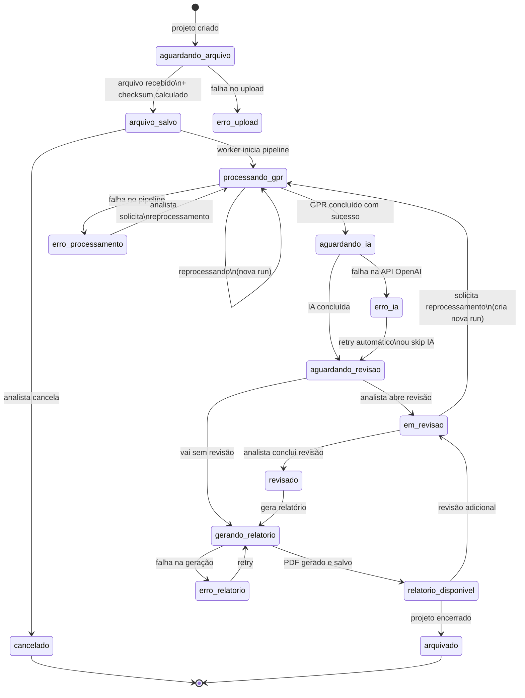

---

## 13. Versionamento por Run

Como runs são criadas, nunca sobrescritas, e como o sistema mantém histórico completo.

```mermaid
flowchart TD
    subgraph PROJETO["Projeto: projeto_ternium_rj_2026-05-20"]
        subgraph RAW["raw/ — imutável"]
            R1["arquivo_original.DZT\n29.3 MB"]
            R2["arquivo_original.DZT.sha256\nsha256: a1b2c3d4..."]
        end

        subgraph RUNS["runs/ — histórico completo"]
            subgraph RUN1["run_001_2026-05-20_a1b2c3d4/"]
                RUN1_A["config_used.json\nparâmetros originais"]
                RUN1_B["resultados_deteccoes.npy\n(19 detecções)"]
                RUN1_C["radargrama_migrado.npy"]
                RUN1_D["radargrama_agc.npy"]
            end

            subgraph RUN2["run_002_2026-05-21_a1b2c3d4/"]
                RUN2_A["config_used.json\nvelocidade ajustada: 0.09→0.10"]
                RUN2_B["resultados_deteccoes.npy\n(22 detecções)"]
                RUN2_C["radargrama_migrado.npy"]
                RUN2_D["radargrama_agc.npy"]
                RUN2_E["⭐ run ativa\n(mais recente)"]
            end
        end

        subgraph DB_RUNS["Supabase: tabela runs"]
            DB1["run_001: status=superseded"]
            DB2["run_002: status=active\n(is_active=true)"]
        end
    end

    subgraph REGRAS["Regras de Versionamento"]
        RL1["✅ Nova run sempre cria nova pasta"]
        RL2["✅ run anterior fica em status=superseded"]
        RL3["✅ Apenas uma run is_active=true por projeto"]
        RL4["❌ NUNCA deletar run anterior"]
        RL5["❌ NUNCA sobrescrever arquivos existentes"]
        RL6["❌ NUNCA deletar arquivo bruto em raw/"]
    end

    RUN1 -.->|supersedida por| RUN2
    RAW -.->|hash consistente| RUN1
    RAW -.->|hash consistente| RUN2
    RUNS -.->|espelhado em| DB_RUNS
```

---

*Arquivo gerado como parte da documentação-mãe da plataforma ScanSOLO.*  
*Para decisões técnicas detalhadas, ver `DECISOES_TECNICAS_ADR.md`.*  
*Para requisitos completos do produto, ver `PRD_ScanSOLO_Plataforma_Operacional.md`.*
